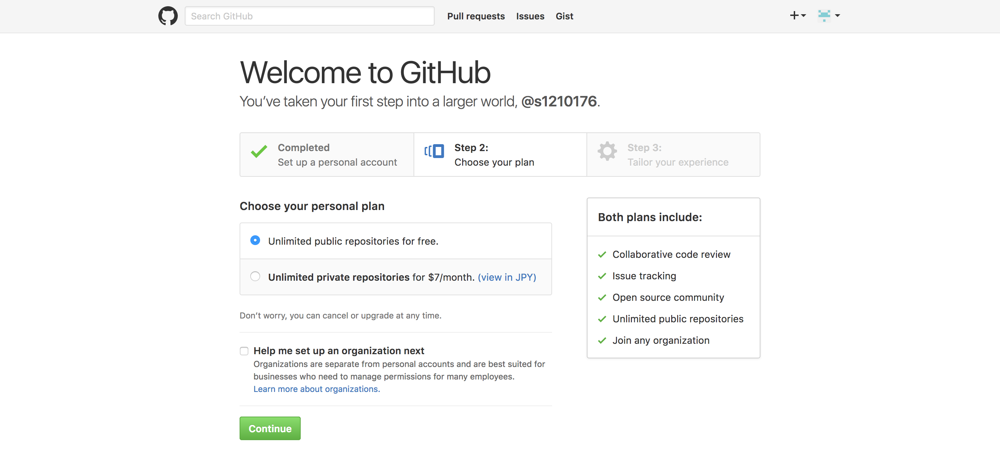
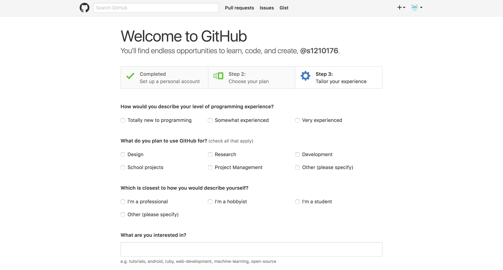
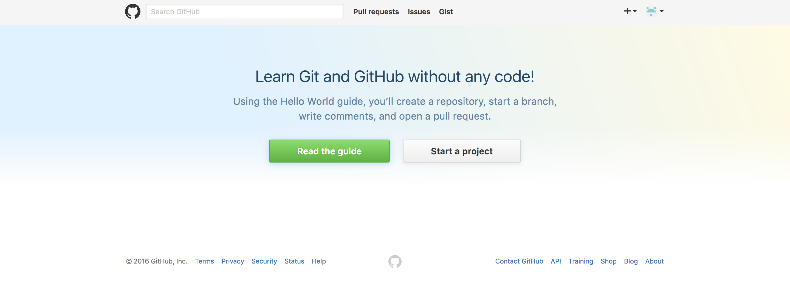
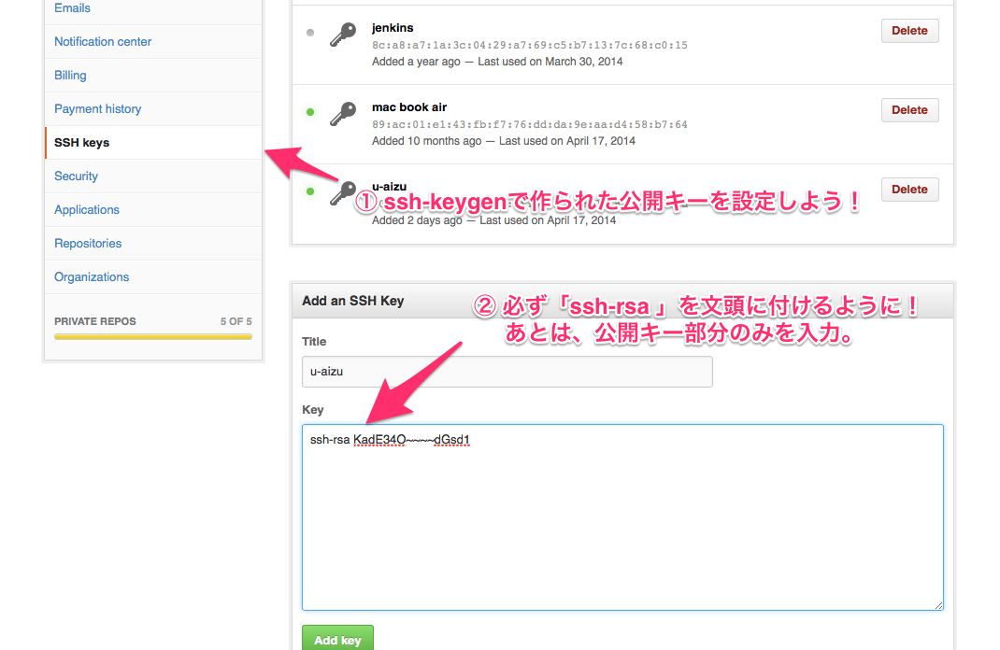

# 課外プロジェクト 2015 実践的プログラミング
2016 4/14 d8161105 渡部未来
資料URL: https://github.com/SCCP2016/introduction

## 1.1 目的
講義を通してアプリケーション開発のノウハウを学び、実用的なアプリケーションを作ってみよう。

## 1.2 今回の演習の目標
- ログインシェルの設定(Bash)
- Gitの導入
- Rubyにおける、HelloWorld
- GitHubによるソースコード管理

## 1.3 教材の紹介
この講義では**Git**と言うバージョン管理システムと**Ruby**と言うScript言語を主に使用します。アプリケーションを作る際の最低限の知識は、以下の資料を参照することで、大体は解決できるはずです。積極的に利用しましょう。
- 教材まとめ
  - https://github.com/SCCP2016
- Git教材
  - https://romtin.gitbooks.io/gittutorial-for-sccp2016/content/
- Ruby教材
  - https://misoton665.gitbooks.io/rubytutorial-for-sccp2016/content/

## 2 シェル
この課外プロジェクトでは、ワークステーションを利用して課題を進めていきます。
ワークステーションのOSは**Unix**系統の**Solaris**を採用しています。
Unix系のOSはハードウェアを操作するのにカーネルと呼ばれる層を通じて命令をする必要がありますが、
一般的にその操作は難解なため、**シェル** と言うアプリケーションを通して**カーネル**とのやり取りが行われます。ユーザは**ターミナル**を通じて命令(コマンド)を実行します。シェルはカーネルがわかるようにコマンドを解釈して伝えます。逆の手順でコマンドの実行した結果をターミナルに表示されるのもシェルのおかげです。


ワークステーションの推奨されるシェルには、*sh*, *csh*, *bash*, *tcsh* などがあります。
他にも *zsh*と呼ばれる人気のシェルなどもあります。ワークステーションのデフォルトでは*csh*が使用されています。*csh*は、補完機能が効いていなかったり、ターミナルの利用頻度が多い場合には利便性に掛けるため、デフォルトでも使いやすい、*bash*を利用します。

### 2.1 ログインシェルの設定
ログイン時のデフォルトシェルを変えるには、*chsh*コマンドで変更をすることができます。*bash*が置いてある絶対パスを指定します。

```
$ chsh
Old Shell: /usr/bin/csh
New Shell [ /bin/sh /bin/csh /usr/local/bin/tcsh /usr/local/gnu/bin/bash ]:
# bashの絶対パスを打ち込む。
/usr/local/gnu/bin/bash
```

絶対パスを打ち込んだあとに、ログインパスワードが聞かれるので入力をすると、次回以降*bash*でログインすることができます。一度ログアウトし、ログインし直しましょう。 *bash*の機能を確認するために、*cd /home/stu* まで打ち込んだらTabキーを押しましょう。*student*の文字が補完されるはずです。

```
-bash-4.2$ cd /home/stu
-bash-4.2$ cd /home/student/
```

##  2.2 alias
シェルは、設定ファイルを編集することで自分好みにカスタマイズすることができます。*bash*の場合には、ホームディレクトリ下の*.bash_profile*がシェルの設定ファイルです。

```
$ emacs $HOME/.bash_profile &
```

試しに設定ファイルの最後に下記の内容を追記してみましょう。

```
# lsに色を付ける。
if [ `uname` = "Darwin" ]; then
  alias ls='ls -FGH'
  elif [ `uname` = "SunOS" ]; then
  alias ls='ls -F --color'
fi
```

※ 空白、シングルクォート、バッククォートに注意して書き写しましょう。

設定ファイルの編集が終わったら、*source* コマンドを使い編集ファイルを読み込ませましょう。
その後、lsを打ちカラーリングされた結果が表示されたら成功です。

```
$ source $HOME/.bash_profile
$ ls
[色がついた結果]
```

## 2.3 プロンプト
*cd*コマンドを利用すると、自分が現在どの位置(パス)に居るのかが知る必要が出てきます。
その場合には、どのようなコマンドを使うことでカレントディレクトリ(現在地)を表示出来るでしょうか？
*cd*する度にカレントディレクトリを表示するのは、あまり効率的とは言えません。ターミナルを開いたときに、コマンド受け付け状態を知らせる文字列があるはずです。*bash*標準だと以下の様な表示になっているはずです。

```
-bash-4.2$
```

この表示のことをプロンプトと呼びます。プロンプトはユーザが自由にカスタマイズすることが出来ます。
そうです。*$HOME/.bash_profile*に以下の内容を追記し、反映してみましょう。

```
# プロンプトにカレントディレクトリを表示
PS1='[ \w ] $ '
```

\wという記号がカレントディレクトリを表示してくれます。
シングルクォートで囲われた残りの文字は好みで編集することが出来ます。自分好みのプロンプトにしてみましょう。

## 2.4 まとめ
コマンドを多く利用する**Unix**では、便利なシェルを利用しているか、使いやすいようにカスタマイズが行き届いているか
などが重要なポイントです。*bash*や他のシェルの利用方法を調べ自分が使いやすいようにカスタマイズしてみましょう。

## 3 Git
ソフトウェア開発では、多くのソースコードやリソースを管理する必要があります。
それらの管理がずさんであると、時として大きな障害の原因になりえます。
例えば、

- 最新のソースコードが判明出来なくなる。
- 大きくソースコードを編集してしまいアプリケーションを壊しまった。
- ソースコードの変更点や変更者が特定できない。

などが障害の原因になりえます。それらの問題を解決するために使われるツールが**Git**になります。

## 3.1 Gitの導入
ワークステーション環境にはGitが標準インストールされていません。UnixやLinux系統のOSでは、
ソースコードをダウンロードし、ビルド(ソースコードをコンパイルし、リンクすること)をすることでバイナリ(実行プログラム)を生成することが基本となります。講義で利用するGitは以下の手順でビルドすることが出来ます。

```
$ cd $HOME
$ mkdir -p local/bin/Git
$ cd local/bin/Git

// Git 1.9.5のソースを取得 https://git-scm.com
$ wget https://www.kernel.org/pub/software/scm/git/git-1.9.5.tar.gz

// ソースを解凍してディレクトリに移動
$ tar xvf git-1.9.5.tar.gz
$ cd git-1.9.5

// ビルド
$ ./configure
$ make
```

ビルド後に*./git*とコマンドを打ち、*commad not found*とならなければ成功です。
ただし、*cd*コマンドで別ディレクトリに移動した場合はパスが違うため*command not found*となってしまいます。
普段使っている*ls*や*cd*コマンドなどはビルドした*git*プログラムと何が違うのでしょうか？それを確かめるには、*which*コマンドを利用します。

```
$ which ls
/usr/local/gnu/bin/ls
$ which who
/usr/local/gnu/bin/who
```

すると、二つのコマンドのバイナリは同じディレクトリ(*/usr/local/gnu/bin*)というディレクトリに置かれている事がわかります。続けて、シェルがコマンドの置き場として許可しているディレクトリのリスト(コマンドサーチパス)を得るためには、以下のコマンドを打ちます。

```
$ echo $PATH
/usr/local/gcc/bin:/usr/local/gcc3/bin:/usr/local/perl5/bin:/usr/local/texlive/bin:/usr/local/bin:/usr/local/gnu/bin:/usr/local/java/jdk/bin:/usr/openwin/bin:/usr/bin:/usr/sbin:/usr/local/LPRng/bin:/usr/local/SolarisStudio/bin:/usr/ccs/bin:/usr/dt/bin
```

ディレクトリのパスは、コロン記号(:)で区切られているため少々分かりづらいですが、*/usr/local/gnu/bin*のパスが発見出来ると思います。つまり、**bash**の設定ファイルにコマンドサーチパスを新たに追加することで、*git*コマンドが使えるようになります。*$HOME/.bash_profile*の冒頭にPATHを設定している場所があると思うので、その末尾に以下のようにパスを追加する記述を書き加えます。

```
PATH=$PATH:$HOME/local/bin/Git/git-1.9.5
```

シェルの設定ファイルを反映した後、*git*コマンドが動いていれば成功になります。

## 3.2 Gitの設定
*git*コマンドが正しく導入できたら、最初に*git*の初期設定を行いましょう。

```
# gitの変更履歴に残すための名前。自由で良い。
$ git config --global user.name "ユーザ名"
$ git config --global user.email "メールアドレス"
# vim・emacsなどの好きなエディタを設定。
$ git config --global core.editor "vim or emacs"
```

## 3.3 RubyのHelloWorldをGit管理してみよう。
適当なディレクトリを用意し、*git*のプロジェクト管理下に置いてみましょう。

```
$ cd
$ mkdir hello-ruby
$ cd hello-ruby
$ git init
```

*ls -a*コマンドを打ち、*.git*ディレクトリが生成されていれば、そのディレクトリはgitの管理下(Gitリポジトリ)に置かれています。 *emacs* を開き、HelloWorld(hello.rb)プログラムを書いてみましょう。

```ruby
puts "HelloWorld"
```

**Ruby** のプログラムは以下のようにして実行します。

```
ruby hello.rb
```

プログラムが完成したら、ソースコードの変更を*git*に伝えます。*git log* コマンドで今までの変更履歴を見ることが出来ます。

```
git add hello.rb
git commit -m "First commit"
git log
```

## 3.4 GitHub
**Git** で管理したリポジトリは、別なマシン(サーバ)にクローンすることで、障害が起きたときのリスク回避に使えます。今回はリモートリポジトリとして使える以下のサービスを使ってみましょう。

- GitHub (https://github.com)
- Bitbucket (https://bitbucket.org)

特に**GitHub**はGitを扱うサービスで一番有名なサービスで、多くの企業やエンジニアが利用しています。
授業の課題などをGitで管理するときには、リポジトリの非公開を無料でおこなえる**Bitbucket**を利用しましょう。
今回の講義ではGitHubでみなさんのコードを共有して、より良いコードを参考にしてみましょう。

### 3.4.1 Github 登録
コードを共有するにあたり、まずGitHub (http://github.com) に登録する必要があります。
実際に上のURLからGithubアクセスしてみましょう。


トップページの上部にGitHub新規アカウント作成を行うためのフォームがあります。  
登録するユーザー名とメールアドレスについては、3.1節にて

```
# gitの変更履歴に残すための名前。自由で良い。
$ git config --global user.name "ユーザ名"
$ git config --global user.email "メールアドレス"
```

このコマンドを実行する時に使ったユーザ名とメールアドレスを使います。  
もし忘れたと言う方もそうでない方も、以下のコマンドで今一度登録するユーザ名とパスワードを確認しておきましょう。

```
$ git config --list |grep user.name
$ git config --list |grep user.email
```

画像に従ってユーザー名、メールアドレス、パスワードを入力し終わったら、**[Sign up for GitHub]** ボタンをクリックしましょう。入力内容に不備がなければ次のページへ進みます。



このページでは、GitHubアカウントのプランを指定します。  
GitHubには無料プランと有料プランの二つのプランが存在していて、無料プランでは公開リポジトリの作成が無制限となり、有料プランでは非公開リポジトリの作成も無制限となります。  
今回は無料プランを選択します。画像の中で選択されている、 *Unlimited public repositories for free.* を選択し、**[Continue]** ボタンから次のページへ進みましょう。



このページでは自分のプログラミング技術レベルや、GitHubの利用目的などのアンケートを行っています。特に答えたくないと思った場合はページ下部のボタンから *skip* しても良いでしょう。


**[Submit]** ボタンもしくは *skip this step* リンクをクリックすると、登録が完了しGithubのトップページへと戻ります。




**最後に登録したメールアドレスのメールボックスをチェックし、GitHubアカウントのメール認証を済ませておきましょう。**

### 3.4.2 GitHub リポジトリ作成

### 3.4.3 GitHub SSHの設定
ローカルリポジトリとリモートリポジトリのやりとりは、セキュア(安全)に行われる必要があります。
GitHubでは、https(**SSL**)と**SSH**の２つの暗号化手法を使っています。
今回は、SSHを使った暗号化手法で通信をおこないましょう。
まずはじめに、SSHを行うための鍵(公開鍵と秘密鍵)を生成します。

```
# パスフレーズなどは空白のままエンターを押しましょう。
$ ssh-keygen -t rsa
```

ホーム下の*./ssh2*ディレクトリに移動すると公開鍵(*id_rsa_2048_xxx.pub*)と秘密鍵(*id_rsa_2048_xxx*)が確認できます。

```
$ cd $HOME/.ssh2
# 秘密鍵のパーミッションは閉じられている。
$ ls -a
$ cat id_rsa_2048_*.pub

---- BEGIN SSH2 PUBLIC KEY ----
Subject: [学籍番号]
Comment: 鍵情報
[ここが鍵の中身になります。コピーしましょう。]
---- END SSH2 PUBLIC KEY ----
```

Githubの設定ページ(トップ右上の自分のアイコンメニューからSettingのリンク)
へ飛びSSH keysを設定します。(間違っても秘密鍵を設定しないように！)
コメント類は削除し、ssh-rsa という文字列を文頭に付けてキーのみを貼り付けましょう。



最後に、リモートリポジトリのURLを指定し、先ほど作ったリポジトリをGitHubに*push*します。

```
$ git remote add origin [リモートリポジトリURL]
$ git push -u origin master
```


ブラウザで自分のソースコードが確認出来たら終了です。お疲れ様でした。
